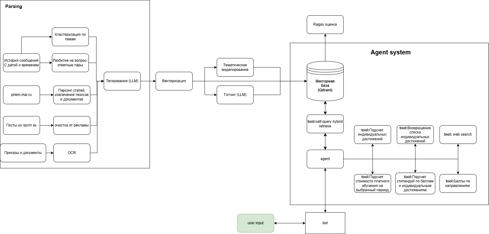

# Yandex Multimodal Assistant

## Описание проекта  
**Yandex Multimodal Assistant** — это проактивный ассистент-бот для абитуриентов МАИ. Система состоит из **агента** и **Telegram-бота**

### Цель  
- Закрывают до 90 % типовых вопросов без участия человека  
- Отвечают за ≤ 20 секунд  
- Обрабатывают до 2000 сообщений в день 


## Основные компоненты

### 1. Telegram-бот (`src/telegram_bot`)  
Интерфейс пользователя в Telegram, реализованный на **aiogram v3**.  
- **loader.py** — инициализация бота, установка команд  
- **handlers/** — команды `/start`, `/instruction`, `/help`, обработка текстовых и голосовых сообщений  
- **dao/** — `UserDAO` (SQLAlchemy AsyncSession + PostgreSQL) для работы с таблицей `users` (профиль, история, портрет)  
- **middleware.py** — управление сессиями через DAO  
- **models/** — ORM-модель `User` (поле `current_messages: JSON`, `psychological_profile` и др.)

### 2. Агент (`src/react_agent`)  
Обрабатывает запросы, обращается к инструментам и собирает ответ.  
- **graph.py** — граф и логика переходов состояния агента  
- **prompts.py** — шаблоны system/user-prompt для LLM  
- **state.py** — внутреннее состояние агента, управление сессией диалога  
- **tools.py** — реализация инструментов:  
  - расчёт стипендий и проходных баллов  
  - стоимость обучения  
  - поиск по внешним источникам  и тд
- **configuration.py** — параметры моделей и системные подсказки

### 3. Данные и предобработка (`src/react_agent/data`)  

Источник знаний для RAG-подхода.  
- **Источники**: сайт priem.mai, PDF-документы, Telegram-чаты абитуриентов, посты «ВКонтакте», Google Forms  
- **OCR**: Yandex OCR для сканов PDF  
- **Предобработка**:  
  1. удаление шума и дубликатов  
  2. семантическая кластеризация (~2000 токенов на чанк)  
  3. суммаризация чанков  
  4. теггинг по 30+ тематическим меткам  

### 4. Индекс и поиск  
- **qDrant** для эмбеддингов и гибридного поиска  
- **Метаданные** для точной фильтрации по теме  

### 5. Speech-to-Text  
- **Yandex SpeechKit** для распознавания голосовых сообщений в Telegram  

## Архитектура


[Презентация решения](https://www.canva.com/design/DAGmD4NibeA/nDMmDWEzgEbTpb3zFBArRg/edit)

[Google Drive](https://drive.google.com/drive/folders/1DAMl06ZVpxBqQhkPIB5iLdKH2YCAKFY5) 

Отлично, спасибо за конкретику 👌. Давай обновим README с четким описанием того, **как запускать проект** и **какие переменные окружения нужны**. Вот обновленный блок, который ты можешь вставить:

---

## 🚀 Как запустить проект

### 1️⃣ Запуск агента

Перейдите в корень запустите:

```bash
langgraph dev
```


### 2️⃣ Запуск Telegram-бота

```bash
python -m src.telegram_bot.app.main
```

---

## ⚙️ Переменные окружения

Создайте файл `.env` или используйте `env.example` для примера. Укажите следующие переменные:

```env
# Токен Telegram-бота
TG_API_TOKEN=

# Доступ к Yandex SpeechKit + YandexGPT
API_KEY=
FOLDER_ID=

# Доступ к Qdrant (векторное хранилище)
QDRANT_URL=
QDRANT_API_KEY=

# (Опционально) IAM Token для Yandex Cloud
IAM_TOKEN=
```

❗ **Важно:** переменные должны быть прописаны в `.env` **и подгружаться в коде через `load_dotenv()` или аналогично.**
